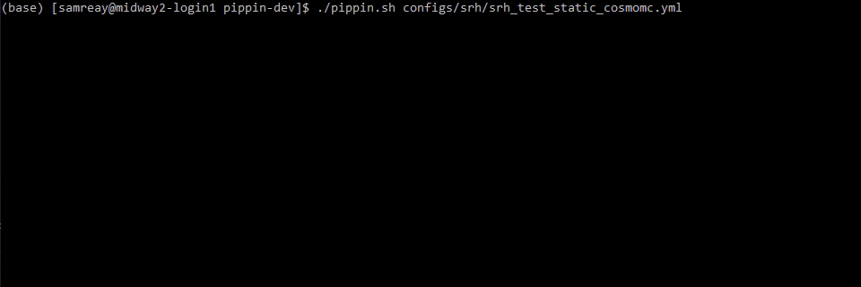

[](https://doi.org/10.21105/joss.02122)
[](https://zenodo.org/badge/latestdoi/162215291)
[](https://github.com/Samreay/Pippin/blob/master/LICENSE)
[](https://github.com/Samreay/Pippin/releases)
[](https://github.com/Samreay/Pippin/issues)

[](https://travis-ci.com/Samreay/Pippin)

# Pippin


Pippin - a pipeline designed to streamline and remove as much hassle as we can
when running end-to-end supernova cosmology analyses.


## Table of Contents


- [Using Pippin](#using-pippin)
- [Installing Pippin](#installing-it-fresh)
- [Contributing to Pippin](#issues-and-contributing-to-pippin)
- [Examples](#examples)
- [FAQ](#faq)
- [Tasks](#tasks)
    - [DataPrep](#data-preparation)
    - [Simulation](#simulation)
    - [Light Curve Fit](#light-curve-fit)
    - [Classification](#classification)
    - [Aggregation](#aggregation)
    - [Merging](#merging)
    - [Bias Corrections](#bias-corrections)
    - [Create Covariance](#create-covariance)
    - [CosmoMC](#cosmomc)
    - [Analyse](#analyse)
- [Adding a new Task](#adding-a-new-task)
- [Adding a new classifier](#adding-a-new-classifier)


## Installing it fresh

If you're using a pre-installed version of Pippin - like the one on Midway, ignore this.

If you're not, installing Pippin is simple.

1. Checkout Pippin
2. Ensure you have the dependencies install (`pip install -r requirements.txt`) and that your python version is 3.7+.
3. Celebrate

There is no need to attempt to install Pippin like a package (no `python setup.py install`), just run from the clone.

Now, Pippin also interfaces with other tasks: SNANA and machine learning classifiers mostly. I'd highly recommend 
running on a high performance computer with SNANA already installed, but if you want to take a crack at installing it,
[you can find the docoumentation here](https://github.com/RickKessler/SNANA).

I won't cover installing SNANA here, hopefully you already have it. But to install the classifiers, we'll take
[SuperNNova](https://github.com/supernnova/SuperNNova) as an example. To install that, find a good place for it and:

1. Checkout `https://github.com/SuperNNova/SuperNNova`
2. Create a GPU conda env for it: `conda create --name snn_gpu --file env/conda_env_gpu_linux64.txt`
3. Activate environment and install natsort: `conda activate snn_gpu` and `conda install --yes natsort`

Then, in the Pippin global configuration file `cfg.yml` in the top level directory, ensure that the SNN path in Pippin is
pointing to where you just cloned SNN into. You will need to install the other external software packages
if you want to use them, and you do not need to install any package you do not explicitly request in a config file.

## Using Pippin

Using Pippin is very simple. In the top level directory, there is a `pippin.sh`. If you're on midway and use SNANA, this
script will be on your path already. To use Pippin, all you need is a config file ready to go. I've got a bunch of mine and 
some general ones in the `configs` directory, but you can put yours wherever you want. I recommend adding your initials to the 
front of the file to make it obvious in the shared output directory which folders as yours.

If you have `example.yml` as your config file and want pippin to run it, easy:
`pippin.sh example.yml`

The file name that you pass in should contain a run configuration. Note that this is different to the global software
configuration file `cfg.yml`, and remember to ensure that your `cfg.yml` file is set up properly and that you know 
where you want your output to be
installed. By default, I assume that the `$PIPPIN_OUTPUT` environment variable is set as the output location,
so please either set said variable or change the associated line in the `cfg.yml`. [For the morbidly curious, here
is a very small demo video of using Pippin in the Midway environment](https://www.youtube.com/watch?v=pCaPvzFCZ-Y).




### Creating your own configuration file

Each configuration file is represented by a yaml dictionary linking each stage (see stage declaration section below) to 
a dictionary of tasks, the key being the unique name for the task and the value being its specific task configuration.

For example, to define a configuration with two simulations and one light curve fitting task (resulting in 2 output simulations and
2 output light curve tasks - one for each simulation), a user would define:

```yaml
SIM:
  SIM_NAME_1:
    SIM_CONFIG: HERE
  SIM_NAME_2:
    SIM_CONFIG: HERE
    
LCFIT:
  LCFIT_NAME_1:
    LCFIT_CONFIG: HERE
```

How to configure each task is also detail below on a task-by-task basis, or you can see examples in the `examples`
 directory for each task.
 
 
### What If I change my config file?

Happens all the time, don't even worry about it. Just start Pippin again and run the file again. Pippin will detect
any changes in your configuration by hashing all the input files to a specific task. So this means, even if you're 
config file itself doesn't change, changes to an input file it references (for example, the default DES simulation
input file) would result in Pippin rerunning that task. If it cannot detect anything has changed, and if the task
finished successfully the last time it was run, the task is not re-executed. You can force re-execution of tasks using the `-r` flag.


### Command Line Arguments

On top of this, Pippin has a few command line arguments, which you can detail with `pippin.sh -h`, but I'll also detail here:

```bash
  -h                 Show the help menu
  -v, --verbose      Verbose. Shows debug output. I normally have this option enabled.
  -r, --refresh      Refresh/redo - Rerun tasks that completed in a previous run even if the inputs haven't changed.
  -c, --check        Check that the input config is valid but don't actually run any tasks.
  -s, --start        Start at this task and refresh everything after it. Number of string accepted
  -f, --finish       Finish at this stage. For example -f 3 or -f CLASSIFY to run up to and including classification. 
  -p, --permission   Fix permissions and groups on all output, don't rerun
```

For an example, to have a verbose output configuration run and only do data preparation and simulation, 
you would run

`pippin.sh -vf 1 configfile.yml`


### Stages in Pippin

You may have noticed above that each stage has a numeric idea for convenience and lexigraphical sorting.

The current stages are:

* `0, DATAPREP` Data preparation
* `1, SIM`: Simulation
* `2, LCFIT`: Light curve fitting
* `3, CLASSIFY`: Classification (training and testing)
* `4, AGG`: Aggregation (comparing classifiers)
* `5, MERGE`: Merging (combining classifier and FITRES output)
* `6, BIASCOR`: Bias corrections using BBC
* `7, CREATE_COV`: Create input files needed for CosmoMC
* `8, COSMOMC`: Run CosmoMC and fit cosmology
* `9, ANALYSE`: Create final output and plots. Includes output from CosmoMC, BBC and Light curve fitting.

### Pippin on Midway

On midway, sourcing the SNANA setup will add environment variables and Pippin to your path.

Pippin itself can be found at `$PIPPIN`, output at `$PIPPIN_OUTPUT` (which goes to a scratch directory), and `pippin.sh` will automatically work from
any location.

Note that you only have 100 GB on scratch. If you fill that up and need to nuke some files, look both in `$SCRATCH_SIMDIR` to remove SNANA 
photometry and `$PIPPIN_OUTPUT` to remove Pippin's output. I'd recommend adding this to your `~/.bashrc` file to scan through directories you own and 
calculate directory size so you know what's taking the most space. After adding this and sourcing it, just put `dirusage` into the terminal
in both of those locations and see what's eating your quota.

```bash
function dirusage {
    for file in $(ls -l | grep $USER | awk '{print $NF}')
    do
        du -sh "$file"
    done
}
```

## Issues and Contributing to Pippin

Contributing to Pippin or raising issues is easy. Here are some ways you can do it, in order of preference:

1. Submit an [issue on Github](https://github.com/samreay/Pippin), and then submit a pull request to fix that issue.
2. Submit an [issue on Github](https://github.com/samreay/Pippin), and then wait until I have time to look at it. Hopefully thats quickly, but no guarantees.
3. Email me with a feature request

If you do want to contribute code, fantastic. [Please note that all code in Pippin is subject to the Black formatter](https://black.readthedocs.io/en/stable/). 
I would recommend installing this yourself because it's a great tool.


## Examples

If you want detailed examples of what you can do with Pippin tasks, have a look in the [examples directory](https://github.com/Samreay/Pippin/tree/master/examples),
pick the task you want to know more about, and have a look over all the options.

Here is a very simple configuration file which runs a simulation, does light curve fitting, and then classifies it using the
debug FITPROB classifier.

```yaml
SIM:
  DESSIM:
    IA_G10_DES3YR:
      BASE: surveys/des/sim_ia/sn_ia_salt2_g10_des3yr.input

LCFIT:
  BASEDES:
    BASE: surveys/des/lcfit_nml/des_5yr.nml
  
CLASSIFICATION:
  FITPROBTEST:
    CLASSIFIER: FitProbClassifier
    MODE: predict
```

You can see that unless you specify a `MASK` on each subsequent task, Pippin will generally try and run everything on everything. So if you have two
simulations defined, you don't need two light curve fitting tasks, Pippin will make one light curve fit task for each simulation, and then two classification tasks,
one for each light curve fit task.

### Anchoring in YAML files

If you are finding that your config files contain lots of duplicated sections (for example, many simulations configured
almost the same way but with one differnece), consider using YAML anchors. [See this blog post](https://blog.daemonl.com/2016/02/yaml.html)
for more detail. You can define your anchors in the main config section, or add a new section (like SIM, LCFIT, CLASSIFICATION). So long as it doesn't
match a Pippin keyword for each stage, you'll be fine. I recommend `ANCHORS:` at the top of the file, all of those will work.


## FAQ

**Pippin is crashing on some task and the error message isn't useful**

Feel free to send me the log and stack, and I'll see what I can do turn the exception into something
more human-readable.

**I want Pippin to run after I log out** 

Rather than redirecting Pippin output to a file or running it in the background, I *highly recommend* you run
Pippin in a `screen` session. 

For example, if you are doing machine-learning testing, you may create a new screen session called `ml` 
by running `screen -S ml`. It will then launch a new instance of bash for you to play around in. conda **will not work out of the box**. To make
it work again, run `conda deactivate` and then `conda activate`, and you can check this works by running `which python` and 
verifying its pointing to the miniconda install. You can then run Pippin as per normal: `pippin.sh -v your_job.yml` and get the coloured output. 
To leave the screen session, but *still keep Pippin running even after you log out*, press `Ctrl-A, Ctrl-D`. As in one, and then the other, not `Ctrl-A-D`. 
This will detach from your screen session but keep it running. Just going `Ctrl_D` will disconnect and shut it down. To get back into your screen session,
simply run `screen -r ml` to reattach. You can see your screen
sessions using `screen -ls`. 

You may notice if you log in and out of midway that your screen sessions might not show up. This is because midway has multiple head nodes, and
your screen session exists only on one of them. This is why when I ssh to midway I specify a specific login node instead
of being assigned one. To make it simpler, I'd recommend setting up
an alias like so to either `login1` or `login2`:

```yaml
alias sshmidway="ssh username@midway2-login1.rcc.uchicago.edu"
```

**I want to modify a ton of files but don't want huge yml files, please help**

You can modify input files and put them in a directory you own, and then tell Pippin to look there 
(in addition to the default location) when its constructing your tasks. To do this, see [this example here](https://github.com/Samreay/Pippin/blob/master/examples/global.yml),
or use this code snippet at the top of your YAML file (not that it matters if it's at the top):

```yaml
GLOBAL:
  DATA_DIRS:
    - /some/new/directory/with/your/files/in/it
```

**I don't want to run this massive jobs again! Let me use external results!**

Good news, everyone! Not only is there a dedicated config file for globally useful tasks, but its easier than ever to slow them
into your existing jobs. For useful precomputed work, such as biascor sims and trained machine learning classifiers, check out `$PIPPIN_OUTPUT/GLOBAL`.

For an example on how to use these results, check out the reference 5YR analysis `ref_des_5yr.yml`.  There are in essense two ways of 
including external tasks. Both operate the same way, one is just a bit more explicit than the other. The explicit way is when adding 
a task that is an *exact* replica of an external task, you can just add the `EXTERNAL` keyword. For example, in the reference 5YR analysis,
all the biascor sims are precomputed, so we can define them as external tasks like this:

```yaml
SIM:
  DESSIMBIAS5YRIA_C11:
    EXTERNAL: $PIPPIN_OUTPUT/GLOBAL/1_SIM/DESSIMBIAS5YRIA_C11
  DESSIMBIAS5YRIA_G10:
    EXTERNAL: $PIPPIN_OUTPUT/GLOBAL/1_SIM/DESSIMBIAS5YRIA_G10
  DESSIMBIAS5YRCC:
    EXTERNAL: $PIPPIN_OUTPUT/GLOBAL/1_SIM/DESSIMBIAS5YRCC
```

Point to the external task output directory. In this case, we use the `EXTERNAL` keyword because each task we define has an explicit one-to-one match
with an external task.

But then say we don't want to recompute the light curve fits. After all, most of the time we're not changing that step anyway! Well, we set up the tasks
in the same way as we normally would, but now there **isn't** a one-to-one mapping. See the config snippet below:

```yaml
LCFIT:
  D:
    BASE: surveys/des/lcfit_nml/des_5yr.nml
    MASK: DESSIM
    EXTERNAL_DIRS:
      - $PIPPIN_OUTPUT/GLOBAL/2_LCFIT/D_DESSIMBIAS5YRIA_C11
      - $PIPPIN_OUTPUT/GLOBAL/2_LCFIT/D_DESSIMBIAS5YRIA_G10
      - $PIPPIN_OUTPUT/GLOBAL/2_LCFIT/D_DESSIMBIAS5YRCC
```

That is, we have one `LCFIT` task, but because we have three sims going into it and matching the mask, we can't point a single external directory.
But what we can do is point to multiple! And then if the output directory matches (ie `D_DESSIMBIAS5YRIA_C11` is the base name for both a computed
task output directory and an external task directory), it will instead use that.

Note that you still need to point to the right base file, because Pippin still wants those details. It won't be submitted anywhere though, just
loaded in. 

The flexibility of `EXTERNAL_DIRS` means you can mix both precomputed and non-precomputed tasks together. Take this classificaiton task:

```yaml
CLASSIFICATION:
  SNNTEST:
    CLASSIFIER: SuperNNovaClassifier
    MODE: predict
    OPTS:
      MODEL: $PIPPIN_OUTPUT/GLOBAL/3_CLAS/SNNTRAIN_DESTRAIN/model.pt
    EXTERNAL_DIRS:
      - $PIPPIN_OUTPUT/GLOBAL/3_CLAS/SNNTEST_DESSIMBIAS5YRIA_C11_SNNTRAIN_DESTRAIN
      - $PIPPIN_OUTPUT/GLOBAL/3_CLAS/SNNTEST_DESSIMBIAS5YRIA_G10_SNNTRAIN_DESTRAIN
      - $PIPPIN_OUTPUT/GLOBAL/3_CLAS/SNNTEST_DESSIMBIAS5YRCC_SNNTRAIN_DESTRAIN
```

It will load in the precomputed classification results for the biascor sims, and then also run and generate classification results on any other
simulation tasks (such as running on the data) using the pretrained model `model.pt`.

Finally, the way this works under the hood is simple - it copies the directory over explicitly. And it will only copy once, so if you want the 
"latest version" just ask the task to refresh (or delete the folder). Once it copies it, there is no normal hash checking,
it reads in the `config.yml` file created by the task in its initial run and powers onwards.

If you have any issues using this new feature, check out the `ref_des_5yr.yml` file or flick me a message.

## Tasks

Pippin is essentially a wrapper around many different tasks. In this section, 
I'll try and explain how tasks are related to each other, and what each task is.

As a general note, most tasks have an `OPTS` where most details go. This is partially historical, but essentially properties
that Pippin uses to determine how to construct tasks (like `MASK`, classification mode, etc) are top level, and the Task itself gets passed everything
inside `OPTS` to use however it wants. 

### Data Preparation

The DataPrep task is simple - it is mostly a pointer for Pippin towards an external directory that contains
some photometry, to say we're going to make use of it. Normally this means data files,
though you can also use it to point to simulations that have already been run to save yourself
the hassle of rerunning them.  The other thing the DataPrep task will do is run the new 
method of determining a viable initial guess for the peak time, which will be used by the light curve fitting task down the road. 
The full options available for the DataPrep task are:

```yaml
DATAPREP:
  SOMENAME:
    OPTS:
    
      # Location of the photometry files
      RAW_DIR: $DES_ROOT/lcmerge/DESALL_forcePhoto_real_snana_fits
      
      # Specify which types are confirmed Ia's, confirmed CC or unconfirmed. Used by ML down the line
      TYPES:
        IA: [101, 1]
        NONIA: [20, 30, 120, 130]

      # Blind the data. Defaults to True if SIM:True not set
      BLIND: False
      
      # Defaults to False. Important to set this flag if analysing a sim in the same way as data, as there
      # are some subtle differences
      SIM: False

```

### Simulation

The simulation task does exactly what you'd think it does. It invokes [SNANA](https://github.com/RickKessler/SNANA) to run some similation as per your configuration. 
If something goes wrong, Pippin tries to dig through the log files to give you a useful error message, but sometimes this
is difficult (i.e. the logs have been zipped up). With the current version of SNANA, each simulation can have at most one Ia component, 
and an arbitrary number of CC components. The specification for the simulation task config is as follows:

```yaml
SIM:
  SOMENAMEHERE:
  
    # We specify the Ia component, so it must have IA in its name
    IA_G10: 
      BASE: surveys/des/sims_ia/sn_ia_salt2_g10_des5yr.input  # And then we specify the base input file which generates it.
      
    # Now we can specify as many CC sims to mix in as we want
    II_JONES:
      BASE: surveys/des/sims_cc/sn_collection_jones.input
    
    IAX:
      BASE: surveys/des/sims_cc/sn_iax.input
      DNDZ_ALLSCALE: 3.0  # Note you can add/overwrite keys like so for specific files

    # This section will apply to all components of the sim
    GLOBAL:
      NGEN_UNIT: 1
      RANSEED_REPEAT: 10 12345
```

### Light Curve Fit

This task runs the SALT2 light curve fitting process on light curves from the simulation or DataPrep task. As above,
if something goes wrong I try and give a good reason why, if you don't get a good reason, let me know. The task is 
specified like so:

```yaml
LCFIT:
  SOMENAMEHERE:
    # MASK means only apply this light curve fitting on sims/Dataprep which have DES in the name
    # You can also specify a list for this, and they will be applied as a logical or
    MASK: DES
      
    # The base nml file used 
    BASE: surveys/des/lcfit_nml/des.nml
      
    # FITOPTS can be left out for nothing, pointed to a file, specified manually or a combination of the two
    # Normally this would be a single entry like global.yml shown below, but you can also pass a list
    # If you specify a FITOPT manually, make sure it has the / around the label
    # And finally, if you specify a file, make sure its a yml dictionary that links a survey name to the correct
    # fitopts. See the file below for an example
    FITOPTS:
      - surveys/global/lcfit_fitopts/global.yml
      - "/custom_extra_fitopt/ REDSHIFT_FINAL_SHIFT 0.0001"

    # We can optionally customise keys in the FITINP section
    FITINP:
      FILTLIST_FIT: 'gri'
      
    # And do the same for the optional SNLCINP section
    SNLCINP:
      CUTWIN_SNRMAX:  3.0, 1.0E8
      CUTWIN_NFILT_SNRMAX:  3.0, 99.

    # Finally, options that go outside either of these sections just go in the generic OPTS
    OPTS:
      BATCH_INFO: sbatch $SBATCH_TEMPLATES/SBATCH_Midway2_1hr.TEMPLATE 10
```

### Classification

Within Pippin, there are many different classifiers implemented. Most classifiers need to be trained, and 
can then run in predict mode. All classifiers that require training can either be trained in the same yml 
file, or you can point to an external serialised instance of the trained class and use that. The general syntax
for a classifier is:

```yaml
CLASSIFICATION:
  SOMELABEL:
    CLASSIFIER: NameOfTheClass
    MODE: train  # or predict
    MASK: optional_mask  # Masks both sim and lcfit together, logical and
    MASK_SIM: optional_sim_only_mask
    MASK_FIT: optional_lcfit_only_mask
    OPTS:
      MODEL: file_or_label  # only needed in predict mode, how to find the trained classifier
      WHATREVER_THE: CLASSIFIER_NEEDS  
```

#### SuperNNova Classifier

The [SuperNNova classifier](https://github.com/supernnova/SuperNNova) is a recurrent neural network that
operates on simulation photometry. It has three in vuilt variants - its normal (vanilla) mode, a Bayesian mode
and a Variational mode. After training, a `model.pt` can be found in the output directory,
which you can point to from a different yaml file. You can define a classifier like so:

```yaml
CLASSIFICATION:
  SNN_TEST:
    CLASSIFIER: SuperNNovaClassifier
    MODE: predict
    GPU: True # Or False - determines which queue it gets sent into
    CLEAN: True # Or false - determine if Pippin removes the processed folder to sae space
    OPTS:
      MODEL: SNN_TRAIN  # Havent shown this defined. Or /somepath/to/model.pt
      VARIANT: vanilla # or "variational" or "bayesian". Defaults to "vanilla"
      REDSHIFT: True  # Use redshift info when classifying. Defaults to True.
      NORM: cosmo_quantile  # How to normalise LCs. Other options are "perfilter", "cosmo", "global" or "cosmo_quantile".  
```

#### SNIRF Classifier

The [SNIRF classifier](https://github.com/evevkovacs/ML-SN-Classifier) is a random forest running off SALT2 summary
statistics. You can specify which features it gets to train on, which has a large impact on performance. After training,
there should be a `model.pkl` in the output directory. You can specify one like so:

```yaml
CLASSIFICATION:
  SNIRF_TEST:
    CLASSIFIER: SnirfClassifier
    MODE: predict
    OPTS:
      MODEL: SNIRF_TRAIN
      FITOPT: some_label  # Optional FITOPT to use. Match the label. Defaults to no FITOPT
      FEATURES: x1 c zHD x1ERR cERR PKMJDERR  # Columns to use. Defaults are shown. Check FITRES for options.
      N_ESTIMATORS: 100  # Number of trees in forest
      MIN_SAMPLES_SPLIT: 5  # Min number of samples to split a node on
      MIN_SAMPLES_LEAF: 1  # Minimum number samples in leaf node
      MAX_DEPTH: 0  # Max depth of tree. 0 means auto, which means as deep as it wants.
```

#### Nearest Neighbour Classifier

Similar to SNIRF, NN trains on SALT2 summary statistics using a basic Nearest Neighbour algorithm from sklearn. 
It will produce a `model.pkl` file in its output directory when trained. You can configure it as per SNIRF:


```yaml
CLASSIFICATION:
  NN_TEST:
    CLASSIFIER: NearestNeighborPyClassifier
    MODE: predict
    OPTS:
      MODEL: NN_TRAIN
      FITOPT: some_label  # Optional FITOPT to use. Match the label. Defaults to no FITOPT
      FEATURES: zHD x1 c cERR x1ERR COV_x1_c COV_x1_x0 COV_c_x0 PKMJDERR  # Columns to use. Defaults are shown.
```

#### Perfect Classifier

Sometimes you want to cheat, and if you have simulations, this is easy. The perfect classifier looks into the sims to 
get the actual type, and will then assign probabilities as per your configuration. This classifier has no training mode,
only predict.

```yaml
CLASSIFICATION:
  PERFECT:
    CLASSIFIER: PerfectClassifier
    MODE: predict
    OPTS:
      PROB_IA: 1.0  # Probs to use for Ia events, default 1.0
      PROB_CC: 0.0  # Probs to use for CC events, default 0.0
```

#### Unity Classifier

To emulate a spectroscopically confirmed sample, or just to save time, we can assign every event a probability of 1.0
that it is a type Ia. As it just returns 1.0 for everything, it only has a predict mode

```yaml
CLASSIFICATION:
  UNITY:
    CLASSIFIER: UnityClassifier
    MODE: predict
```

#### FitProb Classifier

Another useful debug test is to just take the SALT2 fit probability calculated from the chi2 fitting and use that
as our probability. You'd hope that classifiers all improve on this. Again, this classifier only has a predict mode.

```yaml
CLASSIFICATION:
  FITPROBTEST:
    CLASSIFIER: FitProbClassifier
    MODE: predict
```

### Aggregation

The aggregation task takes results from one or more classification tasks (that have been run in predict mode
on the same dataset) and generates comparisons between the classifiers (their correlations, PR curves, ROC curves
and their calibration plots). Additionally, it merges the results of the classifiers into a single
csv file, mapping SNID to one column per classifier.

```yaml
AGGREGATION:
  SOMELABEL:
    MASK: mask  # Match sim AND classifier
    MASK_SIM: mask # Match only sim
    MASK_CLAS: mask # Match only classifier
    RECALIBRATION: SIMNAME # Optional, use this simulation to recalibrate probabilities. Default no recal.
    OPTS:
      PLOT: True # Default True, make plots
      PLOT_ALL: False # Default False. Ie if RANSEED_CHANGE gives you 100 sims, make 100 set of plots.
```

### Merging

The merging task will take the outputs of the aggregation task, and put the probabilities from each classifier
into the light curve fit results (FITRES files) using SNID.

```yaml
MERGE:
  label:
    MASK: mask  # partial match on all sim, fit and agg
    MASK_SIM: mask  # partial match on sim
    MASK_FIT: mask  # partial match on lcfit
    MASK_AGG: mask  # partial match on aggregation task
```

### Bias Corrections

With all the probability goodness now in the FITRES files, we can move onto calculating bias corrections. 
For spec-confirmed surveys, you only need a Ia sample for bias corrections. For surveys with contamination, 
you will also need a CC only simulation/lcfit result. For each survey being used (as we would often combine lowz and highz
surveys), you can specify inputs like below.

Note that I expect this task to have the most teething issues, especially when we jump into the MUOPTS.

```yaml
BIASCOR:
  LABEL:
    # The base input file to utilise
    BASE: surveys/des/bbc/bbc.input
    
    # The names of the lcfits_data/simulations going in. List format please. Note LcfitLabel_SimLabel format
    DATA: [DESFIT_DESSIM, LOWZFIT_LOWZSIM]
    
    # Input Ia bias correction simulations to be concatenated
    SIMFILE_BIASCOR: [DESFIT_DESBIASCOR, LOWZFIT_LOWZBIASCOR]

    # For surveys that have contamination, add in the cc only simulation under CCPRIOR    
    SIMFILE_CCPRIOR: DESFIT_DESSIMBIAS5YRCC

    # Which classifier to use. Column name in FITRES will be determined from this property.
    CLASSIFIER: UNITY
    
    # Default False. If multiple sims (RANSEED_CHANGE), make one or all Hubble plots.
    MAKE_ALL_HUBBLE: False
    
    # Defaults to False. Will load in the recalibrated probabilities, and crash and burn if they dont exist.
    USE_RECALIBRATED: True
    
    # Defaults to True. If set to True, will rerun biascor twice, removing any SNID that got dropped in any FITOPT/MUOPT
    CONSISTENT_SAMPLE: False

  
  # We can also specify muopts to add in systematics. They share the structure of the main biascor definition
  # You can have multiple, use a dict structure, with the muopt name being the key
  MUOPTS:
      C11:
        SIMFILE_BIASCOR: [D_DESBIASSYS_C11, L_LOWZBIASSYS_C11]
        SCALE: 0.5 # Defaults to 1.0 scale, used by CREATE_COV to determine covariance matrix contribution
        
  # Generic OPTS that can modify the base file and overwrite properties
  OTPS:
    BATCH_INFO: sbatch $SBATCH_TEMPLATES/SBATCH_Midway2_1hr.TEMPLATE 10
```

For those that generate large simulations and want to cut them up into little pieces, you want the `NSPLITRAN` syntax. 
The configuration below will take the inputs and divide them into 10 samples, which will then propagate to 10 CosmoMC runs
if you have a CosmoMC task defined.

```yaml
BIASCOR:
  LABEL:
    BASE: surveys/des/bbc/bbc_3yr.input
    DATA: [D_DES_G10]
    SIMFILE_BIASCOR: [D_DESSIMBIAS3YRIA_G10]
    PROB_COLUMN_NAME: some_column_name  # optional instead of CLASSIFIER
    OPTS:
      NSPLITRAN: 10
```

### Create Covariance

Assuming the biascor task hasn't died, its time to prep for CosmoMC. To do this, we invoke a script from Dan originally
(I think) that essentially creates all the input files and structure needed by CosmoMC. It provides a way of scaling
systematics, and determining which covariance options to run with.

```yaml
CREATE_COV:
  SOMELABEL:
    MASK: some_biascor_task
    OPTS:
      INI_DIR: /path/to/your/own/dir/of/cosmomc/templates # Defaults to cosmomc_templates, which you can exploit using DATA_DIRS
      SYS_SCALE: surveys/global/lcfit_fitopts/global.yml  # Location of systematic scaling file, same as the FITOPTS file.
      SINGULAR_BLIND: False # Defaults to False, whether different contours will have different shifts applied
      BINNED: True  # Whether to bin the SN or not for the covariance matrx. Defaults to True
      SUBTRACT_VPEC: False # Subtract VPEC contribution to MUERR if True. Used when BINNED: False
      FITOPT_SCALES:  # Optional
        FITOPT_LABEL: some_scale  # Note this is a partial match, ie SALT2: 1.0 would apply to all SALT2 cal fitopts
       MUOPT_SCALES:
        MUOPT_LABEL: some_scale  # This is NOT a partial match, must be exact
       COVOPTS:  # Optional, and you'll always get an 'ALL' covopt. List format please
          - "[NOSYS] [=DEFAULT,=DEFAULT]"  # This syntax is explained below
```

If you don't specify `SYS_SCALE`, Pippin will search the LCFIT tasks from the BIASCOR dependency and if all LCFIT tasks
have the same fitopt file, it will use that.

The `COVOPTS` section is a bit odd. In the square brackets first, we have the label that will be assigned and used
in the plotting output later. The next set of square backets is a two-tuple, and it applies to `[fitopts,muopts]` in 
that order. For example, to get four contours out of CosmoMC corresponding to all uncertainty, statistics only,
statistics + calibration uncertainty, and fitopts + C11 uncertainty, we could set:

```yaml
COVOPTS:
  - "[NOSYS] [=DEFAULT,=DEFAULT]"
  - "[CALIBRATION] [+cal,=DEFAULT]"
  - "[SCATTER] [=DEFAULT,=C11]"
```

### CosmoMC

Launching CosmoMC is hopefully fairly simple. There are a list of provided configurations under the `cosmomc_templates`
directory (inside `data_files`), and the main job of the user is to pick which one they want. 

```yaml
COSMOMC:
  SOMELABEL:
    MASK_CREATE_COV: mask  # partial match
    OPTS:
      INI: sn_cmb_omw  # should match the filename of an ini file
      NUM_WALKERS: 8  # Optional, defaults to eight.
      
      # Optional, covopts from CREATE_COV step to run against. If blank, you get them all. Exact matching.
      COVOPTS: [ALL, NOSYS]
```

### Analyse

The final step in the Pippin pipeline is the Analyse task. It creates a final output directory, moves relevant files into it,
and generates extra plots. It will save out compressed CosmoMC chains and the plotting scripts (so you can download
the entire directory and customise it without worrying about pointing to external files), it will copy in Hubble diagrams,
and - depending on if you've told it to, will make histogram comparison plots between data and sim. Oh and also
redshift evolution plots. The scripts which copy/compress/rename external files into the analyse directory are generally
named `parse_*.py`. So `parse_cosmomc.py` is the script which finds, reads and compresses the MCMC chains from CosmoMC into
the output directory. Then `plot_cosmomc.py` reads those compressed files to make the plots. 

Cosmology contours will be blinded when made by looking at the BLIND flag set on the data. For data, this defaults to
True.

Note that all the plotting scripts work the same way - `Analyse` generates a small yaml file pointing to all the 
resources called `input.yml`, and each script uses the same file to make different plots. It is thus super easy to add your own 
plotting code scripts, and you can specify arbitrary code to execute using the `ADDITIONAL_SCRIPTS` keyword in opts.
Just make sure your code takes `input.yml` as an argument. As an example, to rerun the CosmoMC plots, you'd simply have to 
run `python plot_cosmomc.py input.yml`.

```yaml
ANALYSE:
  SOMELABEL:
    MASK_COSMOMC: mask  # partial match
    MASK_BIASCOR: mask # partial match
    MASK_LCFIT: [D_DESSIM, D_DATADES] # Creates histograms and efficiency based off the input LCFIT_SIMNAME matches. Optional
    OPTS:
      COVOPTS: [ALL, NOSYS] # Optional. Covopts to match when making contours. Single or list. Exact match.
      SHIFT: False  # Defualt False. Shift all the contours on top of each other
      PRIOR: 0.01  # Default to None. Optional normal prior around Om=0.3 to apply for sims if wanted.
      ADDITIONAL_SCRIPTS: /somepath/to/your/script.py  # Should take the input.yml as an argument
```


## Testing valid config in Pippin

<details>
  <summary>Click for the gory details</summary>
  
To ensure we don't break things when pushing out new code, the tests directory contains a set of 
tests progressively increasing in pipeline complexity, designed to ensure that existing config files
act consistently regardless of code changes. Any failure in the tests means a break in backwards compatibility
and should be discussed before being incorporated into a release.

To run the tests, in the top level directory, simply run:

`pytest -v .`

</details>

## Adding a new task

<details>
  <summary>Click for the gory details</summary>
  
  
Alright there, you want to add a new task to Pippin? Great. Here's what you've got to do:

1. Create an implementation of the `Task` class, can keep it empty for now.
2. Figure out where it goes - in `manager.py` at the top you can see the current stages in Pippin. You'll probably need to figure out where it should go. 
Once you have figured it out, import the task and slot it in.
3. Back in your new class that extends Task, you'll notice you have a few methods to implement:
    1. `_run(force_refresh)`: Kick the task off, report True or False for successful kicking off. Determine if you need to rerun the task using both a hash and `force_refresh`. 
    To help with determining the hash, there are a few hand functions: `get_hash_from_string`, `save_hash`, `get_hash_from_files`, `get_old_hash`. See, for example, the Analyse 
    task for an example on how I use these.
    2. `_check_completion(squeue)`: Check to see if the task (whether its being rerun or not) is done. 
    Normally I do this by checking for a done file, which contains either SUCCESS or FAILURE. For example, if submitting a script to a queuing system, I might have this after the primary command:
        ```batch
        if [ $? -eq 0 ]; then
            echo SUCCESS > {done_file}
        else
            echo FAILURE > {done_file}
        fi
        ```
        This allows me to easily see if a job failed or passed. On failure, I then generally recommend looking through the task logs and trying to figure out what went wrong, so you can present a useful message
        to your user. 
        To then show that error, or **ANY MESSAGE TO THE USER**, use the provided logger:
        `self.logger.error("The task failed because of this reason")`. 
        
        This method should return either a) Task.FINISHED_FAILURE, Task.FINISHED_SUCCESS, or alternatively the number of jobs still in the queue, which you could figure out because I pass in all jobs the user has
        active in the variable squeue (which can sometimes be None).
    3. `get_tasks(task_config, prior_tasks, output_dir, stage_num, prefix, global_config)`: From the given inputs, determine what tasks should be created, and create them, and then return them in a list. For context,
    here is the code I use to determine what simulation tasks to create:
        ```python
        @staticmethod
        def get_tasks(config, prior_tasks, base_output_dir, stage_number, prefix, global_config):
            tasks = []
            for sim_name in config.get("SIM", []):
                sim_output_dir = f"{base_output_dir}/{stage_number}_SIM/{sim_name}"
                s = SNANASimulation(sim_name, sim_output_dir, f"{prefix}_{sim_name}", config["SIM"][sim_name], global_config)
                Task.logger.debug(f"Creating simulation task {sim_name} with {s.num_jobs} jobs, output to {sim_output_dir}")
                tasks.append(s)
            return tasks
        ```

</details>

## Adding a new classifier

<details>
  <summary>Click for the gory details</summary>
  
Alright, so what if we're not after a brand new task, but just adding another classifier. Well, its easier to do, and I recommend looking at 
`nearest_neighbor_python.py` for something to copy from. You'll see we have the parent Classifier class, I write out the slurm script that
would be used, and then define the `train` and `predict` method (which both invoke a general `classify` function in different ways, you can do this
however you want.)

You'll also notice a very simply `_check_completion` method, and a `get_requirmenets` method. The latter returns a two-tuple of booleans, indicating 
whether the classifier needs photometry and light curve fitting results respectively. For the NearestNeighbour code, it classifies based
only on SALT2 features, so I return `(False, True)`.

Finally, you'll need to add your classifier into the ClassifierFactory in `classifiers/factory.py`, so that I can link a class name
in the YAML configuration to your actual class. Yeah yeah, I could use reflection or dynamic module scanning or similar, but I've had issues getting
the behaviour consistent across systems and conda environments, so we're doing it the hard way.

</details>
