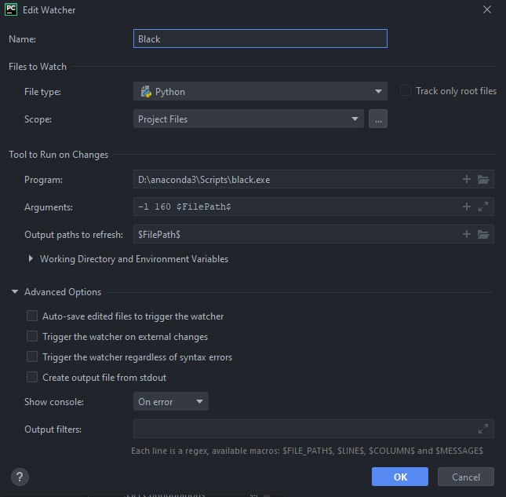

# Pippin Development

## Issues and Contributing to Pippin

Contributing to Pippin or raising issues is easy. Here are some ways you can do it, in order of preference:

1. Submit an [issue on Github](https://github.com/dessn/Pippin/issues), and then submit a pull request to fix that issue.
2. Submit an [issue on Github](https://github.com/dessn/Pippin/issues), and then wait until I have time to look at it. Hopefully thats quickly, but no guarantees.
3. Email me with a feature request

If you do want to contribute code, fantastic. [Please note that all code in Pippin is subject to the Black formatter](https://black.readthedocs.io/en/stable/). I would recommend installing this yourself because it's a great tool.


## Coding style

Please, for the love of god, don't code this up in vim/emacs on a terminal connection[^1]. Use a proper IDE (I recommend PyCharm or VSCode), and **install the Black extension**! I have Black set up in PyCharm as a file watcher, and all python files, on save, are automatically formatted. Use 160 characters a linewidth. Here is the Black file watcher config:



If everyone does this, then all files should remain consistent across different users.

[^1]: {{patrick}}: Since taking over as primary developer, I have done nothing but code this up in vim on a terminal connection. It's not the worst thing you could possibly do. There's a [Black Linter](https://github.com/dessn/Pippin/actions/workflows/black-formatter.yml) github action which will trigger on pull requests to main, allowing you to format your contributions before merging.

## Testing valid config in Pippin

To ensure we don't break things when pushing out new code, the tests directory contains a set of  tests progressively increasing in pipeline complexity, designed to ensure that existing config files act consistently regardless of code changes. Any failure in the tests means a break in backwards compatibility and should be discussed before being incorporated into a release.

To run the tests, in the top level directory, simply run:

`pytest -v .`

## Adding a new task

Alright there, you want to add a new task to Pippin? Great. Here's what you've got to do:

1. Create an implementation of the `Task` class, can keep it empty for now.
2. Figure out where it goes - in `manager.py` at the top you can see the current stages in Pippin. You'll probably need to figure out where it should go. Once you have figured it out, import the task and slot it in.
3. Back in your new class that extends Task, you'll notice you have a few methods to implement:
    1. `_run()`: Kick the task off, report True or False for successful kicking off. To help with determining the hash and whether the task shoudl run, there are a few handy functions: `_check_regenerate`, `get_hash_from_string`, `save_hash`, `get_hash_from_files`, `get_old_hash`. See, for example, the <project:./tasks/analyse.md> task for an example on how I use these.
    2. `_check_completion(squeue)`: Check to see if the task (whether its being rerun or not) is done. Normally I do this by checking for a done file, which contains either SUCCESS or FAILURE. For example, if submitting a script to a queuing system, I might have this after the primary command:
        ```sh
        if [ $? -eq 0 ]; then
            echo SUCCESS > {done_file}
        else
            echo FAILURE > {done_file}
        fi
        ```
        This allows me to easily see if a job failed or passed. On failure, I then generally recommend looking through the task logs and trying to figure out what went wrong, so you can present a useful message to your user. 
        To then show that error, or **ANY MESSAGE TO THE USER**, use the provided logger: 
            `self.logger.error("The task failed because of this reason")`. 
        
        This method should return either a) Task.FINISHED_FAILURE, Task.FINISHED_SUCCESS, or alternatively the number of jobs still in the queue, which you could figure out because I pass in all jobs the user has
        active in the variable squeue (which can sometimes be None).
    3. `get_tasks(task_config, prior_tasks, output_dir, stage_num, prefix, global_config)`: From the given inputs, determine what tasks should be created, and create them, and then return them in a list. For context,
    here is the code I use to determine what simulation tasks to create:
        ```python
        @staticmethod
        def get_tasks(config, prior_tasks, base_output_dir, stage_number, prefix, global_config):
            tasks = []
            for sim_name in config.get("SIM", []):
                sim_output_dir = f"{base_output_dir}/{stage_number}_SIM/{sim_name}"
                s = SNANASimulation(sim_name, sim_output_dir, f"{prefix}_{sim_name}", config["SIM"][sim_name], global_config)
                Task.logger.debug(f"Creating simulation task {sim_name} with {s.num_jobs} jobs, output to {sim_output_dir}")
                tasks.append(s)
            return tasks
        ```

## Adding a new classifier

Alright, so what if we're not after a brand new task, but just adding another classifier. Well, its easier to do, and I recommend looking at 
`nearest_neighbor_python.py` for something to copy from. You'll see we have the parent Classifier class, I write out the slurm script that
would be used, and then define the `train` and `predict` method (which both invoke a general `classify` function in different ways, you can do this
however you want.)

You'll also notice a very simply `_check_completion` method, and a `get_requirmenets` method. The latter returns a two-tuple of booleans, indicating 
whether the classifier needs photometry and light curve fitting results respectively. For the NearestNeighbour code, it classifies based
only on SALT2 features, so I return `(False, True)`.
You can also define a `get_optional_requirements` method which, like `get_requirements`, returns a two-tuple of booleans, indicating whether the classifer needs photometry and light curve fitting results *for this particular run*. By default, this method returns:
- `True, True` if `OPTIONAL_MASK` set in `OPTS`
- `True, False` if `OPTIONAL_MASK_SIM` set in `OPTS`
- `False, True` if `OPTIONAL_MASK_FIT` set in `OPTS`
- `False, False` otherwise.

If you define your own method based on classifier specific requirements, then these `OPTIONAL_MASK*` keys can still be set to choose which tasks are optionally included. If there are not set, then the normal `MASK`, `MASK_SIM`, and `MASK_FIT` are used instead. Note that if *no* masks are set then *every* sim or lcfit task will be included.

Finally, you'll need to add your classifier into the ClassifierFactory in `classifiers/factory.py`, so that I can link a class name
in the YAML configuration to your actual class. Yeah yeah, I could use reflection or dynamic module scanning or similar, but I've had issues getting
the behaviour consistent across systems and conda environments, so we're doing it the hard way.
